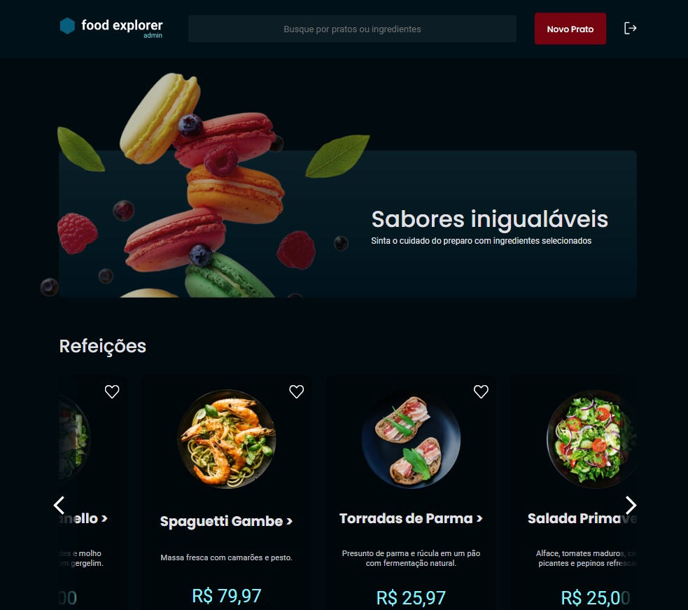

# Food Explorer Frontend

## Layout

## Descrição da aplicação

O Food Explorer é uma aplicação web onde você pode explorar e solicitar pratos de um restaurante fictício. Com esta plataforma, você pode:

- Navegar pelo menu virtual do restaurante.
- Explorar uma variedade de pratos e categorias.
- Visualizar detalhes do prato.
- Personalizar as quantidades, adiciona-los ao seu carrinho de compra e escolher entre os métodos de pagamento.
- Utilizar a barra de busca para encontrar pratos específicos com base em seu nome ou ingrediente.
- Desfrutar de uma experiência responsiva em diversos dispositivos.
- Acessar um perfil de administrador para gerenciar pratos.

## Tecnologias Utilizadas

O frontend foi desenvolvido utilizando as seguintes tecnologias e bibliotecas:

- [Axios](https://axios-http.com/)
- [React](https://reactjs.org/)
- [React DOM](https://reactjs.org/docs/react-dom.html)
- [React Icons](https://react-icons.github.io/react-icons/)
- [React Router DOM](https://reactrouter.com/web/guides/quick-start)
- [Styled Components](https://styled-components.com/)
- [Vite](https://vitejs.dev/)

## Instruções de Instalação e Uso

Para começar a explorar e interagir com o Food Explorer Frontend, siga as instruções abaixo:

Certifique-se de ter o [Node.js](https://nodejs.org/) instalado em seu sistema.

    Clone este repositório para o seu computador:
    $ git clone git@github.com:valtuir-sturlini/food-explorer-frontend.git

    Navegue até o diretório do Frontend no terminal:
    $ cd food-explorer-frontend

    Instale as dependências necessárias:
    $ npm install

    Agora, você pode iniciar a aplicação do Frontend:
    $ npm start

## Perfis Pré-cadastrados

#### Administrador

- Email: admin@email.com
- Senha: 123456

O perfil de administrador tem privilégios elevados, permitindo gerenciar pratos, incluindo criar, atualizar e excluir pratos e suas informações.

#### Usuário Comum

- Email: user@email.com
- Senha: 123456

O perfil de usuário comum tem permissões básicas, como visualizar pratos cadastrados, realizar buscas e adicionar itens ao carrinho.

## Deploy

Este frontend está atualmente hospedado no Netlify, e você pode ver o resultado final da integração com o backend [aqui](https://project-explorer.netlify.app/).

